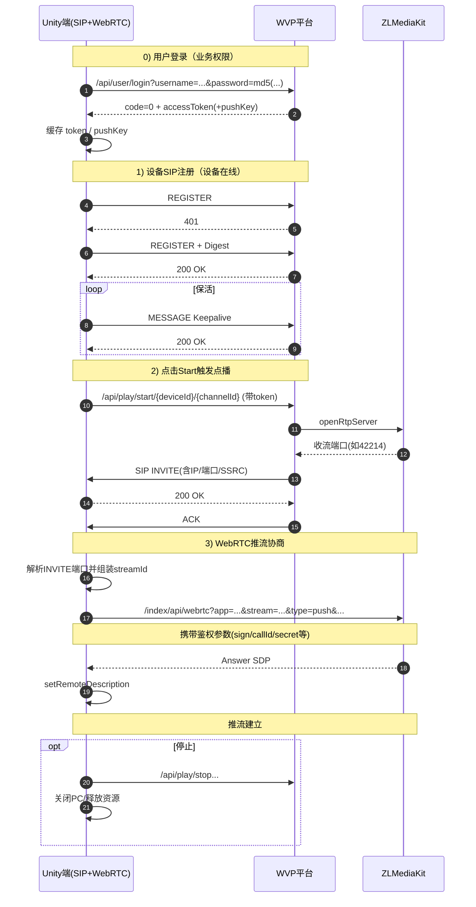

# ZLMediakitPlugin 整体流程（含用户登录）

## 流程概览

- 用户登录（WVP HTTP）用于获取业务调用权限（`accessToken`/`pushKey`）
- 设备注册（SIP REGISTER）用于让 GB28181 设备在线
- 点播触发后，平台反向发 `INVITE` 下发收流参数
- Unity 在拿到收流端口后发起 WebRTC 推流协商

## 时序图

## 关键说明

- 收流端口由平台下发，表示本次点播会话的媒体接收目标端口。
- 拿到收流端口后即可发起 WebRTC 协商；若协商接口鉴权失败，会表现为点播超时（`code=-2`）。
- SIP 在线与 WebRTC 鉴权是两条链路：SIP 成功不代表 WebRTC 推流接口一定有权限。
